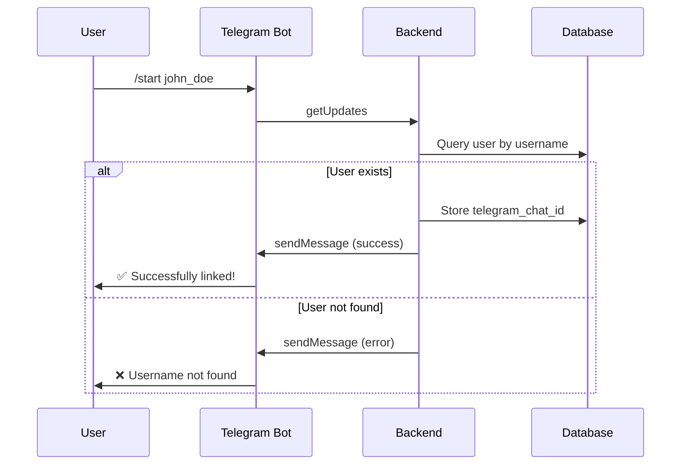

# Telegram Bot Implementation Guide

## Overview

This implementation follows the **Strategy + Adapter design patterns** to create a maintainable and extensible messaging system. The Telegram channel is fully implemented and serves as a template for adding other channels (Email, WhatsApp, Discord).

## Architecture

### Design Patterns Used

1. **Strategy Pattern**: `MessagingStrategy` interface allows swapping different messaging channels
2. **Adapter Pattern**: `TelegramAdapter` wraps the strategy for convenience methods
3. **Open/Closed Principle**: New channels can be added without modifying existing code

### Component Structure

```
backend/app/services/messaging/
├── strategies/
│   ├── base.py              # MessagingStrategy interface
│   ├── telegram.py          # TelegramStrategy + TelegramAdapter
│   ├── email.py             # Email implementation (future)
│   ├── whatsapp.py          # WhatsApp implementation (future)
│   └── discord.py           # Discord implementation (future)
├── telegram_bot.py          # Telegram bot service (polling, commands)
└── service.py               # Main messaging service orchestrator

backend/app/api/v1/endpoints/
└── telegram_bot.py          # Telegram bot API endpoints

backend/app/workers/
└── telegram_polling.py      # Background polling worker
```

## Telegram Implementation Details

### 1. User Onboarding Flow



### 2. Receiving Messages (getUpdates)

The `TelegramBotService.process_updates()` method handles:

- **Polling**: GET https://api.telegram.org/bot<TOKEN>/getUpdates
- **Update tracking**: Maintains `last_update_id` to avoid duplicates
- **Command parsing**: Extracts `/start <username>` commands
- **User validation**: Checks if username exists in database
- **Data storage**: Stores `telegram_chat_id` in `messenger.telegram` JSON column

**Data Structure Stored:**
```json
{
  "chat_id": 123456789,
  "user_id": 987654321,
  "username": "john_doe",
  "linked_at": 1702656000.0
}
```

### 3. Sending Messages (sendMessage)

The `TelegramStrategy.send()` method:

- **POST** https://api.telegram.org/bot<TOKEN>/sendMessage
- Retrieves `chat_id` from user's messenger profile
- Supports HTML formatting
- Appends links to message body

**Example Usage:**
```python
from app.services.messaging.strategies.telegram import TelegramStrategy

strategy = TelegramStrategy()
success = strategy.send(
    to="123456789",  # chat_id
    content="Your daily notification",
    link="https://example.com"
)
```

### 4. Background Polling Worker

Run the polling worker to continuously check for new Telegram messages:

```bash
cd backend
python -m app.workers.telegram_polling --interval 5
```

Or use the API endpoint for manual polling:
```bash
POST /api/v1/telegram/poll-updates
```

## API Endpoints

### 1. Telegram Bot Operations

```http
# Get bot information
GET /api/v1/telegram/bot-info

# Manual polling trigger
POST /api/v1/telegram/poll-updates

# Webhook endpoint (alternative to polling)
POST /api/v1/telegram/webhook

# Check polling status
GET /api/v1/telegram/polling-status
```

### 2. Testing Telegram Integration

```bash
# 1. Start the backend
cd backend
uvicorn app.main:app --reload

# 2. Start the polling worker (in another terminal)
python -m app.workers.telegram_polling

# 3. In Telegram app:
#    - Search for your bot (@YourBotName)
#    - Send: /start your_username
```

## Configuration

### Environment Variables

Add to `backend/.env`:

```env
# Telegram Bot Configuration
TELEGRAM_BOT_TOKEN=your_actual_bot_token_here

# For testing/development, use a dummy token
TELEGRAM_BOT_TOKEN=dummy_telegram_bot_token
```

### Getting a Telegram Bot Token

1. Open Telegram and search for **@BotFather**
2. Send `/newbot`
3. Follow the prompts to create your bot
4. Copy the API token provided
5. Add it to your `.env` file

## Database Schema

The `messengers` table schema:

```sql
CREATE TABLE messengers (
    id BIGINT PRIMARY KEY,
    mail JSON,
    telegram JSON,  -- Stores {chat_id, user_id, username, linked_at}
    whatsapp JSON,
    discord JSON,
    created_at TIMESTAMP,
    updated_at TIMESTAMP
);
```

## Usage Examples

### Example 1: Send Notification to User

```python
from app.services.messaging.service import messaging_service

# MessagingService automatically retrieves chat_id from user's profile
messaging_service.send_message(
    messenger_type="telegram",
    text="Your quiz is ready!",
    link="https://app.example.com/quiz/123",
    user_id=42  # User's platform ID
)
```

### Example 2: Using the Adapter

```python
from app.services.messaging.strategies.telegram import TelegramAdapter

adapter = TelegramAdapter()

# Send alert with formatting
adapter.send_alert(
    chat_id=123456789,
    alert_text="Your subscription expires tomorrow!"
)

# Send with buttons
adapter.send_with_buttons(
    chat_id=123456789,
    text="Choose an action:",
    buttons=[
        [{"text": "Renew", "data": "renew"}, {"text": "Cancel", "data": "cancel"}]
    ]
)
```

### Example 3: Process Commands Manually

```python
from app.database.session import SessionLocal
from app.services.messaging.telegram_bot import telegram_bot_service

with SessionLocal() as db:
    count = telegram_bot_service.process_updates(db)
    print(f"Processed {count} updates")
```

## Adding New Messaging Channels

To add a new channel (e.g., WhatsApp), follow this template:

### Step 1: Create Strategy Implementation

```python
# backend/app/services/messaging/strategies/whatsapp.py

from .base import MessagingStrategy

class WhatsAppStrategy(MessagingStrategy):
    def send(self, to: str, content: str, link: str = None, extra_data: dict = None) -> bool:
        # Implement WhatsApp Cloud API logic here
        pass
```

### Step 2: Update Messaging Service

```python
# backend/app/services/messaging/service.py

from .strategies.whatsapp import WhatsAppStrategy

class MessagingService:
    def __init__(self):
        self.strategies = {
            "mail": EmailStrategy(),
            "telegram": TelegramStrategy(),
            "whatsapp": WhatsAppStrategy(),  # Add new channel
            "discord": DiscordStrategy()
        }
```

### Step 3: Add Configuration

```env
# .env
WHATSAPP_API_TOKEN=your_token_here
WHATSAPP_PHONE_NUMBER_ID=your_phone_id_here
```

## Testing Checklist

- [ ] Bot responds to /start command
- [ ] Invalid username returns error message
- [ ] Valid username stores chat_id in database
- [ ] Sending messages works with stored chat_id
- [ ] Polling worker runs continuously
- [ ] Multiple updates processed correctly
- [ ] Dummy token mode works for development
- [ ] HTML formatting renders correctly
- [ ] Link appending works

## Security Considerations

1. **Never commit real tokens**: Use `.env` file (in `.gitignore`)
2. **Token validation**: Check token exists before API calls
3. **Rate limiting**: Implement rate limits for webhook/polling
4. **Input sanitization**: Validate all user inputs
5. **Error handling**: Don't leak sensitive info in error messages

## Performance Optimization

1. **Polling interval**: Adjust based on message volume (default: 5s)
2. **Batch processing**: Process multiple updates in single iteration
3. **Database indexing**: Index `messengers.telegram->>'chat_id'`
4. **Caching**: Cache user-to-chat_id mappings
5. **Async operations**: Consider async HTTP requests for better performance

## Troubleshooting

### Bot doesn't receive messages
- Check `TELEGRAM_BOT_TOKEN` is set correctly
- Verify polling worker is running
- Check bot has permission to receive messages
- Look for errors in worker logs

### /start command not working
- Ensure username exists in database
- Check username spelling (case-sensitive)
- Verify database connection
- Check logs for errors

### Messages not sending
- Verify chat_id is stored correctly
- Check API token permissions
- Test with bot info endpoint
- Look for API rate limits

## Next Steps

1. ✅ **Telegram**: Fully implemented
2. ⬜ **Email**: Implement using SMTP/SendGrid
3. ⬜ **WhatsApp**: Implement using WhatsApp Cloud API  
4. ⬜ **Discord**: Implement using Discord Bot API
5. ⬜ **Add webhook support** as alternative to polling
6. ⬜ **Implement retry logic** for failed sends
7. ⬜ **Add analytics** for message delivery tracking
